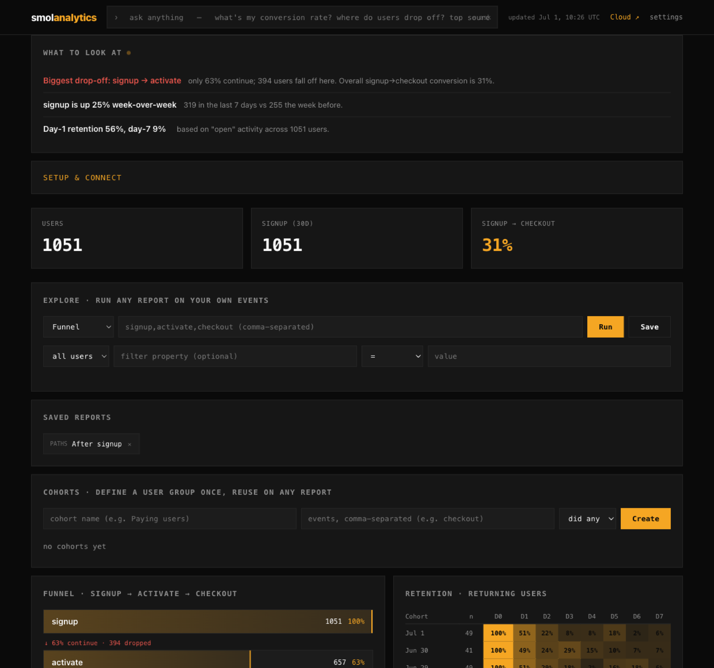

<div align="center">

# smolanalytics

**web + product analytics in one Go binary. ask it in your editor. the numbers provably match the dashboard.**

[](https://github.com/Arjun0606/smolanalytics/actions/workflows/ci.yml)
[](https://github.com/Arjun0606/smolanalytics/releases)
[](LICENSE)
[](https://go.dev)
[](https://github.com/Arjun0606/smolanalytics/stargazers)

[**Live demo**](https://smolanalytics-demo.fly.dev) &nbsp;·&nbsp; [**Docs**](docs/README.md) &nbsp;·&nbsp; [**Cloud**](https://smolanalytics.com) &nbsp;·&nbsp; [**Star this repo ★**](https://github.com/Arjun0606/smolanalytics/stargazers)

</div>

<br>

[](https://smolanalytics-demo.fly.dev)

<div align="center"><sub>the real product on demo data. <a href="https://smolanalytics-demo.fly.dev"><b>open the live demo →</b></a></sub></div>

<br>

> ### your ai assistant admits it hallucinates your numbers. mine can't. it's a ci test.

Every analytics tool now has an AI assistant. It is bolted inside their app, you pay for it, and it answers by generating a query (HogQL, SQL) that can silently disagree with the dashboard. PostHog's own MCP docs say results _"may not match the UI."_

smolanalytics removes that whole failure mode. You ask from your own editor with your own model, so there is no AI bill. Every answer is a deterministic report, never generated SQL, and a CI [agreement test](internal/api/agreement_test.go) fails the build if the MCP answer and the `/v1` API ever disagree by a single byte. It **cannot make up a number**.

And it is a complete platform, not a toy under that wedge: funnels, retention, paths, cohorts, and the Plausible-shaped web view, plus **feature flags, A/B testing, click heatmaps, in-product surveys, a session inspector, and deploy-impact**, all from one MIT Go binary. No Kafka, no ClickHouse, no cluster. Your data never leaves your box.

## Try it in 30 seconds

```sh
docker run -p 8080:8080 ghcr.io/arjun0606/smolanalytics demo
```

<details><summary>or the single binary / <code>go run</code></summary>

```sh
# install script (macOS / Linux)
curl -fsSL https://raw.githubusercontent.com/Arjun0606/smolanalytics/main/install.sh | sh
smolanalytics demo

# or with Go
go run github.com/Arjun0606/smolanalytics/cmd/smolanalytics@latest demo
```
</details>

Open `localhost:8080`: a fully populated dashboard, a "what to fix" verdict up top, and an ask bar with your real events and pages as one-click chips. Nothing to configure. Prefer not to install? The [**live demo**](https://smolanalytics-demo.fly.dev) is the real product on demo data, running right now.

## Ask your analytics where you write code

This is the point of the whole tool. smolanalytics is an MCP server, so your coding agent queries your real analytics without you leaving the editor. It has your codebase, your tracking plan, and smolanalytics over MCP, so it answers in your terms: ask _"what's the MAU for the PQR page"_ and it knows PQR is the `/pqr` route from your code. Your model does the reasoning, so there are no API keys and nothing metered.

```sh
smolanalytics connect          # wires it into every coding assistant you have installed
```

```
you ▸ how's activation, and is pro converting better than free?
ai  ▸ Activation is 62% (657 of 1,051 signups reach "activate").
      Pro converts 2.4× better end-to-end: 45% signup→checkout vs 19% on free.
      The leak is activate→checkout on free (only 31% continue). Want the paths after activate?
```

Your model gets **73 tools and 14 built-in prompts**, and it runs the whole product, not just queries: ask reports, roll out a flag, read the A/B result, create a cohort, set an alert, verify instrumentation. Anything it creates shows up on the dashboard instantly.

| Assistant | command | Assistant | command |
|---|---|---|---|
| Claude Code | `smolanalytics connect claude-code` | Cursor | `smolanalytics connect cursor` |
| Claude Desktop | `smolanalytics connect claude` | Windsurf | `smolanalytics connect windsurf` |
| VS Code (Copilot) | `smolanalytics connect vscode` | Cline | `smolanalytics connect cline` |

<details><summary>Wire it up by hand, or point at a remote server over HTTP</summary>

```jsonc
// stdio (local, reads your data file directly)
{ "mcpServers": { "smolanalytics": { "command": "smolanalytics", "args": ["mcp"] } } }

// HTTP (point at a running instance, local or remote)
{ "mcpServers": { "smolanalytics": { "url": "http://localhost:8080/mcp" } } }
```

Claude Code, HTTP: `claude mcp add --transport http smolanalytics http://localhost:8080/mcp`. Any MCP client works (stdio + Streamable HTTP). When a **read** key is set, add `"headers": { "Authorization": "Bearer YOUR_KEY" }`.
</details>

There is also a built-in **dashboard ask bar** (zero setup, no code lookup) for quick data questions like _"visitors to /pricing"_ or _"where do people drop off?"_.

## The whole toolkit, one binary

The usual advice is "run Plausible for web, something heavier for product, and separate tools for flags, experiments, and surveys." smolanalytics is all of it, computed from one append-only event log, and every surface is askable in your editor.

| | what you get | ask it, or hit the API |
|---|---|---|
| **Product analytics** | funnels (ordered / strict / unordered, exclusions, per-step filters, breakdowns), retention (rolling + weekly buckets), trends (count / sum / avg / p90), paths, lifecycle, stickiness, cohorts, sequenced behavioral cohorts, B2B account groups | `funnel` `retention` `trends` `paths` `lifecycle` `stickiness` `create_sequence_cohort` `groups` |
| **Web analytics** | visitors, live-now, top pages, referrers, UTM, devices, the Plausible-shaped view | `web_overview` · `/v1/web` |
| **Feature flags** | boolean + multivariate, property targeting + percentage rollout, deterministic bucketing so the SDK and the agent always agree; `smol.flag()` in the browser SDK | `create_flag` `evaluate_flag` · `/v1/flags/evaluate` |
| **A/B testing** | flags measured on a goal event, per-variant conversion after first exposure, lift vs control, 95% two-proportion z-test | `flag_impact` · `/v1/flags/{key}/measure` |
| **Click heatmaps** | click-density grid + top clicked elements per page and viewport, from `$click` autocapture | `heatmap` · `/v1/heatmap` |
| **In-product surveys** | NPS / rating / choice / text, URL + sampling targeting, dependency-free SDK widget | `create_survey` `survey_results` · `/v1/surveys/*` |
| **Session inspector** | event-based journey replay: pages, clicks with positions, rage-clicks, ms timing | `list_sessions` `session_timeline` · `/v1/sessions` |
| **Deploy impact** | before/after metric attribution per commit: _which ship moved the metric_ | `deploy_impact` · `/v1/deploys?event=` |

Full tool + prompt reference: [docs/prompts.md](docs/prompts.md) · the plain-`GET` stats API: [docs/api.md](docs/api.md).

## Provably correct, or it fails CI

The [agreement test](internal/api/agreement_test.go) asserts, on every build, that the MCP answer equals the `/v1` HTTP API answer byte-for-byte for the same question across `funnel`, `retention`, `trends`, `web_overview`, `paths`, `heatmap`, `flag_impact`, `survey_results`, `list_sessions`, and more. The dashboard renders from those same reports, so it cannot drift either. There is no second query path to disagree with. This is the one thing an AI-answer layer built on generated SQL structurally cannot promise.

## Send events (web, mobile, server)

One snippet **autocaptures pageviews + clicks**. Add `track()` for the moments you care about.

```html
<script src="https://YOUR_HOST/sdk.js"></script>
<script>
  smolanalytics.init("YOUR_WRITE_KEY", { host: "https://YOUR_HOST" });
  smolanalytics.track("signup", { plan: "pro" });   // optional, for funnels
  smolanalytics.identify("user_123");                // on login
</script>
```

Ingestion is one endpoint, so anything with an HTTP client works (`curl -XPOST $HOST/v1/events ...`). And there are published native SDKs with an offline-safe queue, batching, sessions, and lifecycle events:

| Platform | install |
|---|---|
| **Swift** (iOS) | SPM: `github.com/Arjun0606/smolanalytics-swift` |
| **Kotlin / Android** | JitPack: `com.github.Arjun0606:smolanalytics-android` |
| **React Native / Expo** | npm: `smolanalytics-react-native` |
| **Flutter / Dart** | pub.dev: `smolanalytics` |

Framework guides (2 minutes each): [Next.js](docs/nextjs.md) · [React](docs/react.md) · [Vue](docs/vue.md) · [Backend](docs/backend.md) · [Mobile](docs/mobile.md). Or paste one line into Cursor / Claude Code and let it instrument the app: [docs/agents.md](docs/agents.md).

## Which deploy moved the metric?

Every other tool shows you the graph dropped. It cannot tell you _which ship_ dropped it, because it does not have your commits. Record a marker in CI (`smolanalytics deploy`, one line) and ask your editor _"did my last deploy move signups?"_ and you get a before/after read that leads with any regression, computed from the same reports (correlation, not proof, and the copy says so).

## How it compares

|  | smolanalytics | Plausible / Fathom | Mixpanel / Amplitude | PostHog |
|---|:---:|:---:|:---:|:---:|
| Funnels · retention · paths · cohorts | ✅ | ⚠️ paid / partial | ✅ | ✅ |
| Flags · A/B · surveys · heatmaps · sessions | ✅ **one binary** | ❌ | ⚠️ separate / paid | ✅ |
| Ask in plain English | ✅ **your AI, free** | ❌ | 💲 their AI | 💲 their AI + MCP |
| AI numbers match the dashboard | ✅ **CI-enforced** | n/a | ⚠️ | ⚠️ _"may not match the UI"_ |
| Which deploy moved the metric | ✅ | ❌ | ❌ | ❌ |
| Self-host | ✅ one binary | ✅ | ❌ | ⚠️ Kafka + ClickHouse |
| Own your data · export | ✅ | ✅ | ⚠️ | ✅ |

Three things they structurally cannot copy: the AI is **yours** (they meter theirs); answers come from **exact reports** with CI proving they match the dashboard; your data **never leaves your box**.

## Run it in production

```sh
docker run -p 8080:8080 -v $PWD/data:/data \
  -e SMOLANALYTICS_WRITE_KEY=$(openssl rand -hex 16) \
  -e SMOLANALYTICS_PASSWORD=$(openssl rand -hex 12) \
  ghcr.io/arjun0606/smolanalytics
```

One static binary, no cgo, no cluster. It binds `127.0.0.1` by default and refuses to serve real data unauthenticated on a public interface. Two keys: a **public write key** (ingest only, ships in your HTML) and a **secret read key** (reports, export, MCP). Scale to billions of events on flat RAM with an optional S3 / R2 / Tigris cold tier, keep a `SMOLANALYTICS_RETAIN_DAYS` window, and cron `smolanalytics brief` for a morning digest. Full config, backups, and the storage design: [Deploy guide](docs/README.md) · [STABILITY.md](STABILITY.md).

## Own it, forever

- **Private by architecture.** No third party, no cookies by default, a cookieless mode that needs no consent banner, and GDPR erasure in one call (`DELETE /v1/users/{id}/data`). The answer to _"who can see this data?"_ is: you.
- **MIT, no CLA, no rug-pull.** There is no license to revoke. Fork it the day you stop liking us.
- **No lock-in.** `GET /v1/export` hands you everything as CSV or JSONL, and the JSONL round-trips back into `/v1/events`. Import from PostHog, Mixpanel, Amplitude, Umami, CSV, or JSONL with original timestamps.
- **Works without us.** One static binary, no phone-home, no license server. If this repo went dark tomorrow, your instance would not notice.

## Don't want to run it? → [smolanalytics Cloud](https://smolanalytics.com)

Self-hosting is the free tier, unlimited, forever. The [hosted cloud](https://smolanalytics.com) adds an isolated instance per project, your whole team, the morning brief delivered, and scale with zero ops. **14-day full-product trial** (no card), then **Pro $29/mo** (1M events) or **Scale $99/mo** (10M events), flat **$5 per extra million**. Overage never locks your dashboard.

## The one thing it deliberately does not do

Feature flags, A/B, heatmaps, surveys, a session inspector, cohorts: all ship, all from the same binary. The single deliberate exception is **pixel-perfect DOM / video session replay** (the screen-recording kind), which needs a heavy recorder and a separate blob store and would break the single-binary model. The event-based **session inspector** ships instead. Also by design: no multi-node / clustering / HA. Exactly one writer per instance is why it self-hosts in 30 seconds.

## Contributing

PRs welcome. Keep it small, correct, and dependency-free ([CONTRIBUTING.md](CONTRIBUTING.md)). Security: [SECURITY.md](SECURITY.md).

## License

[MIT](LICENSE), forever. No CLA, no relicense: the business is the hosted cloud, never the license. Use it, fork it, host it, sell hosting of it.

<div align="center">
<br>

**If smolanalytics is useful, a ★ helps other people find it.**

[](https://github.com/Arjun0606/smolanalytics/stargazers)

</div>
